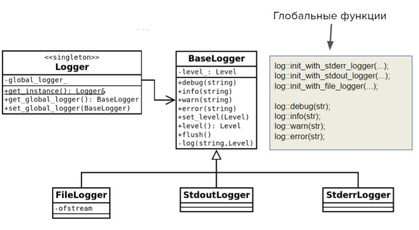

## Домашнее задание №2

Создать библиотеку с именем и пространством имен log.
Функционал библиотеки должен позволять записывать лог программы в стандартные потоки вывода/ошибок и в файл.
Лог должен обладать 4 уровнями с именами: debug, info, warning, error.
При выводе сообщения указывается его уровень. Лог выводит только те сообщения, которые выше (приоритетнее) его уровня.

