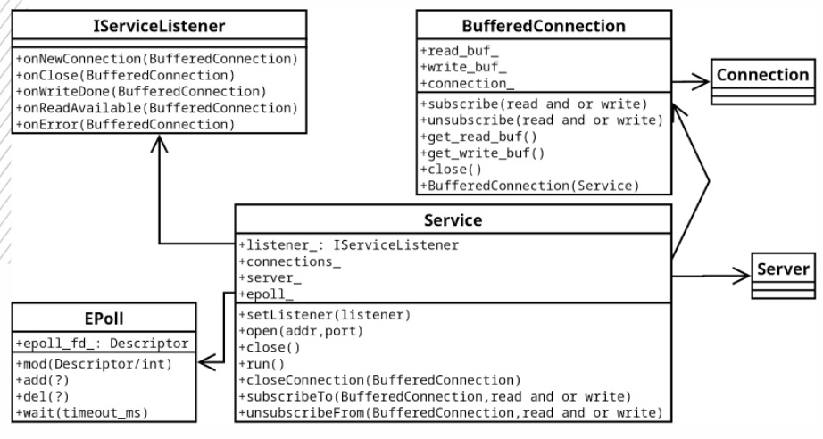

## Домашнее задание №5

Создать библиотеку с именем net.
В библиотеке должен быть реализован класс сервиса Service, который позволяет управлять соединениями через callback интерфейс IServiceListener.
Библиотека должна гарантировать базовую безопасность исключений.

