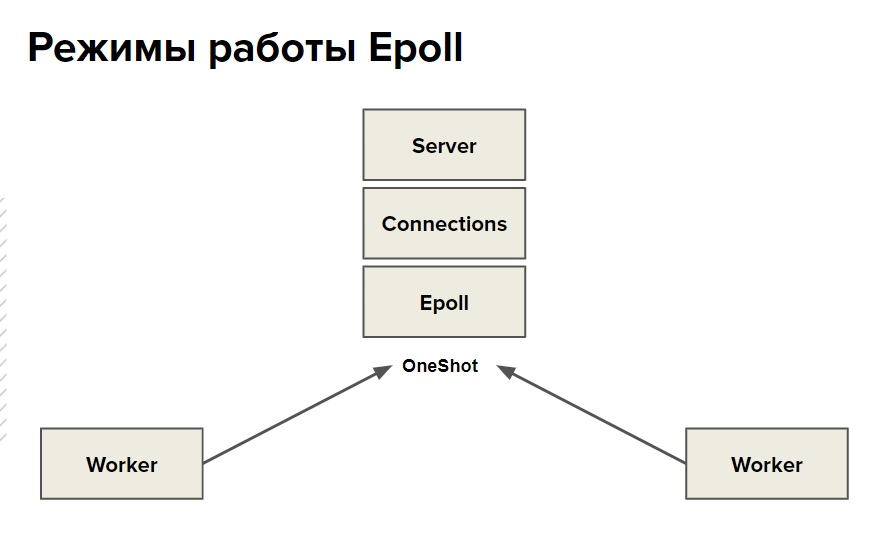

## Домашнее задание №6

Создать библиотеку с именем http.
В библиотеке должен быть реализован класс сервиса HttpServer, который позволяет принимать http запрос и отправлять ответ через callback:
OnRequest(HttpServer&, HttpConnection&);

HttpServer должен работать многопоточно, число потоков задается при старте. Должен поддерживаться флаг keep-alive .
Библиотека должна гарантировать базовую безопасность исключений.

